# 📚 Array Techniques – A Comprehensive Guide with Code Examples

This document covers powerful techniques used with arrays in algorithmic problem solving. Each section includes:
- **Why it's used**
- **How it works**
- **Example problems**
- **Code example**

---

## ✅ Table of Contents

1. [Prefix Sum](#1-prefix-sum)
2. [Sliding Window](#2-sliding-window)
3. [Two Pointers](#3-two-pointers)
4. [Binary Search on Arrays](#4-binary-search-on-arrays)
5. [Sorting + Binary Search](#5-sorting--binary-search)
6. [Hash Map / Frequency Map](#6-hash-map--frequency-map)
7. [Stack](#7-stack)
8. [Monotonic Stack / Queue](#8-monotonic-stack--queue)
9. [Greedy](#9-greedy)
10. [Dynamic Programming + Arrays](#10-dynamic-programming--arrays)
11. [Difference Array](#11-difference-array)
12. [Divide and Conquer](#12-divide-and-conquer)
13. [Bit Manipulation](#13-bit-manipulation)
14. [Prefix XOR](#14-prefix-xor)
15. [Backtracking + Arrays](#15-backtracking--arrays)

---

## 1. Prefix Sum

### 📊 Diagram (Prefix Sum Array Construction)
```mermaid
graph LR
    A[Original Array] --> B{Sum[i] = Sum[i-1] + A[i]}
    B --> C[Prefix Sum Array]
```

**Why**: Efficient range sum queries after preprocessing.

### Example: Subarray Sum
```python
def prefix_sum(arr):
    prefix = [0] * (len(arr) + 1)
    for i in range(len(arr)):
        prefix[i+1] = prefix[i] + arr[i]
    return prefix

arr = [1, 2, 3, 4]
prefix = prefix_sum(arr)
# sum from index 1 to 3: prefix[4] - prefix[1] = 9
```

---

## 2. Sliding Window

### 📊 Diagram (Sliding Window Movement)

```mermaid
sequenceDiagram
    participant A as Array
    Note right of A: Window of size k moves<br>one step each iteration
    A->>A: [i:i+k] → [i+1:i+k+1] → ...
```


**Why**: Avoid recalculating values in contiguous ranges.

### Example: Max sum of subarray of size k
```python
def max_subarray_sum(arr, k):
    window_sum = sum(arr[:k])
    max_sum = window_sum
    for i in range(k, len(arr)):
        window_sum += arr[i] - arr[i - k]
        max_sum = max(max_sum, window_sum)
    return max_sum
```

---

## 3. Two Pointers

### 📊 Diagram (Two Pointers in Action)


**Why**: Efficiently explore subarrays or pairs in sorted arrays.

### Example: Find pair with sum
```python
def has_pair_with_sum(arr, target):
    arr.sort()
    left, right = 0, len(arr) - 1
    while left < right:
        s = arr[left] + arr[right]
        if s == target:
            return True
        elif s < target:
            left += 1
        else:
            right -= 1
    return False
```

---

## 4. Binary Search on Arrays

**Why**: Find elements or boundaries in O(log n).

### Example: Lower bound
```python
def lower_bound(arr, target):
    left, right = 0, len(arr)
    while left < right:
        mid = (left + right) // 2
        if arr[mid] < target:
            left = mid + 1
        else:
            right = mid
    return left
```

---

## 5. Sorting + Binary Search

**Why**: Search on sorted arrays for combinations.

### Example: 3Sum
```python
def three_sum(nums):
    nums.sort()
    res = []
    for i in range(len(nums)):
        if i > 0 and nums[i] == nums[i-1]:
            continue
        l, r = i+1, len(nums)-1
        while l < r:
            total = nums[i] + nums[l] + nums[r]
            if total == 0:
                res.append([nums[i], nums[l], nums[r]])
                l += 1
                r -= 1
            elif total < 0:
                l += 1
            else:
                r -= 1
    return res
```

---

## 6. Hash Map / Frequency Map

**Why**: Count or check existence in O(1).

### Example: Two Sum
```python
def two_sum(nums, target):
    seen = {}
    for i, num in enumerate(nums):
        diff = target - num
        if diff in seen:
            return [seen[diff], i]
        seen[num] = i
```

---

## 7. Stack

**Why**: Track previous or next greater/smaller values.

### Example: Next Greater Element
```python
def next_greater(nums):
    res = [-1] * len(nums)
    stack = []
    for i in range(len(nums)):
        while stack and nums[stack[-1]] < nums[i]:
            res[stack.pop()] = nums[i]
        stack.append(i)
    return res
```

---

## 8. Monotonic Stack / Queue

**Why**: Maintain a max/min in a window efficiently.

### Example: Sliding Window Maximum
```python
from collections import deque

def max_sliding_window(nums, k):
    dq, res = deque(), []
    for i in range(len(nums)):
        while dq and dq[0] <= i - k:
            dq.popleft()
        while dq and nums[dq[-1]] < nums[i]:
            dq.pop()
        dq.append(i)
        if i >= k - 1:
            res.append(nums[dq[0]])
    return res
```

---

## 9. Greedy

**Why**: Choose locally optimal solutions for global optimum.

### Example: Jump Game
```python
def can_jump(nums):
    reach = 0
    for i, num in enumerate(nums):
        if i > reach:
            return False
        reach = max(reach, i + num)
    return True
```

---

## 10. Dynamic Programming + Arrays

**Why**: Solve overlapping subproblems efficiently.

### Example: Maximum Subarray (Kadane’s)
```python
def max_subarray(nums):
    max_sum = curr = nums[0]
    for num in nums[1:]:
        curr = max(num, curr + num)
        max_sum = max(max_sum, curr)
    return max_sum
```

---

## 11. Difference Array

**Why**: Apply multiple range updates in O(1).

### Example: Range addition
```python
def apply_updates(n, updates):
    diff = [0] * (n + 1)
    for start, end, inc in updates:
        diff[start] += inc
        if end + 1 < n:
            diff[end + 1] -= inc
    for i in range(1, n):
        diff[i] += diff[i - 1]
    return diff[:-1]
```

---

## 12. Divide and Conquer

**Why**: Break problems into subarrays.

### Example: Count Inversions
```python
def merge_sort(arr):
    def merge(left, right):
        merged, i = [], 0
        j = 0
        while i < len(left) and j < len(right):
            if left[i] <= right[j]:
                merged.append(left[i])
                i += 1
            else:
                merged.append(right[j])
                j += 1
        merged += left[i:] + right[j:]
        return merged

    if len(arr) <= 1:
        return arr
    mid = len(arr) // 2
    return merge(merge_sort(arr[:mid]), merge_sort(arr[mid:]))
```

---

## 13. Bit Manipulation

**Why**: Solve XOR/parity-based problems.

### Example: Find single number
```python
def single_number(nums):
    result = 0
    for num in nums:
        result ^= num
    return result
```

---

## 14. Prefix XOR

**Why**: Fast XOR range queries.

### Example: Subarrays with XOR k
```python
def subarray_xor(nums, k):
    count, xor, freq = 0, 0, {0: 1}
    for num in nums:
        xor ^= num
        count += freq.get(xor ^ k, 0)
        freq[xor] = freq.get(xor, 0) + 1
    return count
```

---

## 15. Backtracking + Arrays

**Why**: Try all combinations/permutations.

### Example: Subsets
```python
def subsets(nums):
    res = []
    def backtrack(start, path):
        res.append(path[:])
        for i in range(start, len(nums)):
            backtrack(i + 1, path + [nums[i]])
    backtrack(0, [])
    return res
```

---

## 🔗 Combining Techniques

| Combination                  | Use Case Example                               |
|-----------------------------|------------------------------------------------|
| Prefix Sum + Hash Map       | Subarray sum equals `k`                        |
| Sliding Window + Hash Set   | Longest substring without repeating characters |
| Sorting + Two Pointers      | 3Sum, 4Sum                                     |
| Stack + Monotonic Property  | Largest Rectangle in Histogram                 |
| Prefix Sum + Binary Search  | Shortest subarray with sum ≥ `k`               |

---

## 🛠 Real-World Applications

- **Streaming Data**: Sliding window for aggregations
- **Analytics**: Prefix sum for range queries
- **Compilers**: Stack for balanced brackets
- **Search Engines**: Two pointers in merges
- **Networking**: Circular buffers & difference arrays

---

## 📌 Summary

Mastering these techniques allows you to tackle a broad range of DSA problems and real-world applications efficiently.